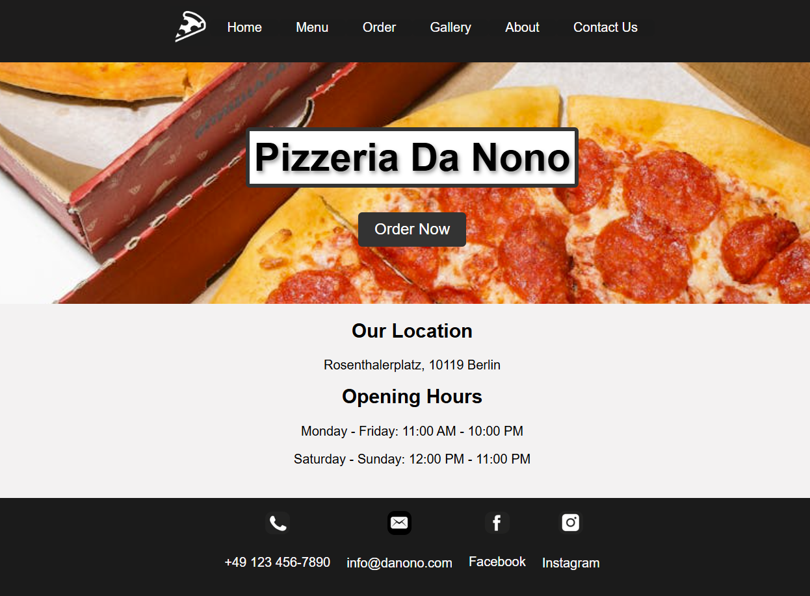

# Pizzeria Da Nono

A modular, single-page web application for a fictional pizzeria. Built using HTML, CSS, and JavaScript, with Webpack for module bundling.



🔗 Live demo: https://estellel-github.github.io/restaurant-page/

## Overview

### Features

- Modular design with interactive modules lets the user navigate between sections like "About Us," "Menu," "Gallery," and "Contact Us" seamlessly.
- A grid-based image gallery showcases the restaurant's ambiance and dishes.
- Layout is responsive to various screen sizes using CSS media queries.

---

## Tools Used

- **Bundling and Dev Server**: Webpack
- **Development**: Visual Studio Code
- **Version Control**: Git and GitHub

- **Static deployment for live demo:** GitHub Pages, gh-pages package (https://www.npmjs.com/package/gh-pages)

---

## Learning Outcomes

- Gained experience using Webpack for efficient bundling and development.
- Made use of modular JavaScript for dynamic content loading.
- Trained skills in responsive design using CSS Grid and media queries.
- Practiced further with additional packages (gh-pages), setting custom scripts for build and deploy in package.json.

---

## How to Use

1. Clone the repository:

   ```bash
   git clone https://github.com/estellel-github/restaurant-page

   ```

2. Install dependencies:

   ```bash
   npm install
   ```

3. Start the development server:

   ```bash
   npm start
   ```

4. Open your browser at http://localhost:8080 (or other custom port) to view the site.
